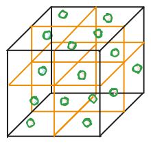

Voxel-slam repository is an open-source Python library designed for fast 
and adaptive comparison of different approaches to solving the voxel-based planar SLAM problem.

Our main goal is to provide extendable, simple and efficient interfaces for
testing various hypotheses, which include different subdivision/segmenter/backend criteria.

[](https://github.com/prime-slam/voxel-slam/actions/workflows/lint.yaml)
[](https://opensource.org/licenses/Apache-2.0)

- - -
# Installation

To use this library you need to download this repository and install necessary dependencies.
How to do this:

1. Download and install Python 3.10 from the [official website](https://www.python.org/downloads/).
2. Clone this repository
    ```bash
    git clone https://github.com/prime-slam/voxel-slam.git
    ```
3. Create and activate virtual environment
    ```bash
    python3 -m venv venv && source venv/bin/activate
    ```
4. Install dependencies
    ```bash
    pip install -r requirements.txt
    ```

Now you have everything you need to run your voxel-based pipeline.

# Examples

Examples of using the voxel-based pipeline are presented in the [`examples`](https://github.com/prime-slam/voxel-slam/tree/main/examples) 
directory with the all necessary instructions of how to run them.

# Contributing

To contribute to the project you must:
1. Get to know the project structure:
    ```
    slam
    ├── backend
    ├── filter
    ├── pipeline
    ├── segmenter
    ├── subdivider
    ├── typing
    └── utils
        ├── dataset_reader
    ```
2. Implement new subdivision/segmenter/backend approach which satisfy the relevant interface.
3. Create PullRequest to the repository.
4. Go through the review and wait for your code to appear in the main branch.
