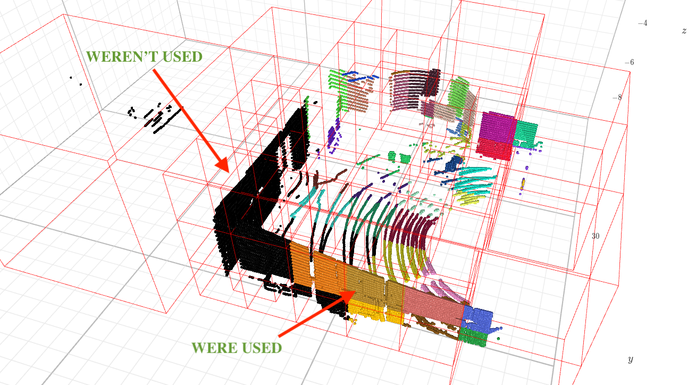

## Structure

This directory contains examples of running voxel-based pipeline and scripts for visualizing plane segmentation results.

```shell
examples
├── configurations
│   ├── hilti.yaml
│   └── kitti.yaml
├── pipeline.py
└── segmentation.py
```

Every `*.py` files contains self-documented instructions of how to run them

## Pipeline configuration

SOVA allows you to configure your pipeline using yaml files, which has following structure:
```yaml
dataset:
  type: "hilti"             # Type of dataset reader to use
  path: "evaluation/hilti"  # Path to data
  patches:                  # Block for patches parameters configuration
    start: 0                # Beginning of optimisations sequence
    end: 29                 # End of optimisations sequence
    step: 10                # Step of optimisations patch
    iterations: 1           # Number of re-optimizations on single patch
pipeline:                   # Block for pipeline configuration
  grid:                     # Grid configuration
    ...
  subdividers:              # Subdividers configuration
    ...
  segmenters:               # Segmenters configuration
    ...
  backend:                  # Backend configuration
    ...
  output: "output/hilti"    # Path to voxel-based pipeline output
debug: false                # Debug parameter which will be send throw the whole pipeline
                            # if it sets true, visualizations using k3d will be saved
```

Grid configuration example:
```yaml
grid:
  voxel_edge_length: 8
```

Subdividers configuration example:
```yaml
subdividers: # You may use one of the following conditions
  size: 1
  count: 50
  eigen_value: 0.5
```

Segmenters configuration example:
```yaml
segmenters: # You may use one of the following conditions
  ransac:
    threshold: 0.01
    initial_points: 6
    iterations: 1000
  cape:
    correlation: 1
  count:
    count: 50
```

Backend configuration example:
```yaml
backend:
  type: "eigen_factor"        # Also bareg available
  parameters:
    iterations_number: 5000
    robust_type: QUADRATIC    # Also HUBER available
```

## Visualization

If you use `debug: true` option, pipeline will save point clouds' k3d visualization in html files. Black colour of points mean they weren't used on optimization stage.


